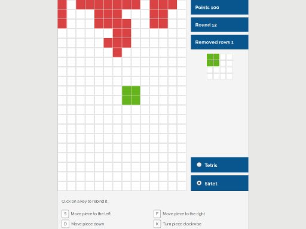

# elm-sirtet: A Tetris clone, written in Elm

elm-sirtet is written in Elm. It features a responsive design based on CSS grid
layout that makes it playable on a range of devices. It has a bottom-up mode
where the pieces are not falling to the bottom but to the top.

You can visit <https://c.rubler.net/elm-sirtet/> to try it out!

## Installation

* Install
    * `npm install`
    * `elm package install`

* Run
    * `npm start`
